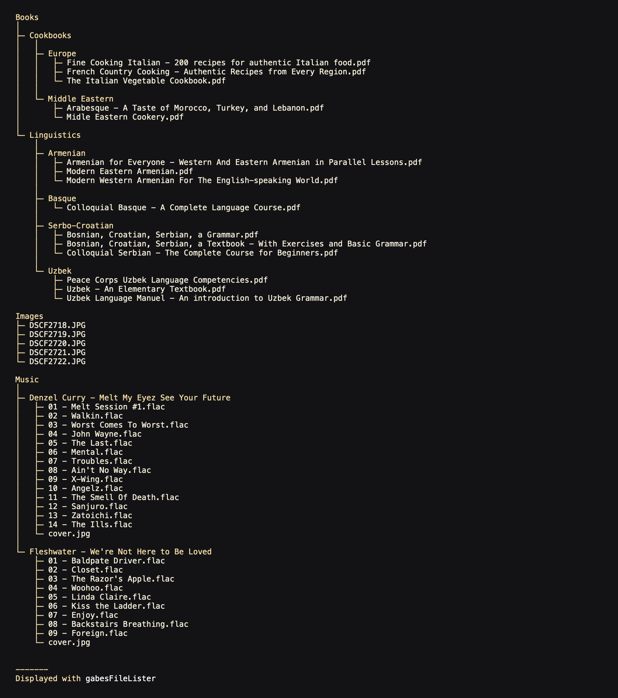
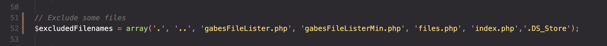
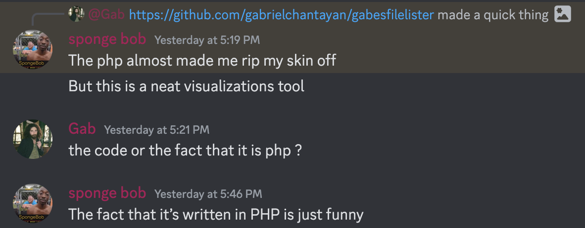

# Gabe's file lister

     

## What is it?
A simple way to make a downloadable file tree. Just drag the one single PHP file to the directory of your choice and voila!

## Features
- Generates a tree of all your files with clickable links to download
- Collapsable filetree to save on screen real estate.
- Ultra-lightweight

## Troubleshooting
### Some of my files arent showing up!x
Gabe's file lister blocks the following files from appearing in the tree: `gabesFileLister.php` `gabesFileListerMin.php` `.DS_Store` `index.php` `files.php` `.git`

### Can I add files to exclude?
Yes! Just add the filename to the array here:

### Can I change X?
Yes! This is open-source! Change it however you want, I'm not the boss of you.

### Can you add X?
Probably not. I had a very simple vision in mind for this project and I am satisfied with how it resulted. You can always [request it in the issues](https://github.com/gabrielchantayan/gabesfilelister/issues) or fork the repo. 

### Why is X hardcoded? Wouldn't having a config be better?
Having a config to modify the look, feel, and behavior of a project would be better in most cases. My goal was to create a super small, super lightweight, super fast, *single-file* solution for creating a downloadable directory lister. Reading from a config would introduce more calls, more time, and more importantly, *more files*. If you want to change anything, the file is simple enough that you can easily find and modify whatever setting you want to change.

### Why PHP?

Short answer: I thought it'd be funny.

Long answer: I wanted this to be just one file. No dependencies, no finicking around with APIs and client-side rendering and libraries and installing new software and so on and so forth. Just one file. Drag and drop in a directory and forget about it. Most webservers aren't going to deal with server-side Node.JS, and most webservers can easily deal with PHP. PHP is the only language I was able to do this in and cover 99.999% of use cases. 

### Why Minified PHP? Isn't there no benefit?
You're right in that there is zero performance benefit to minifying the PHP. The benefit comes from size, where the minified version is smaller than this README. Granted, the difference between the minified and full PHP files are minimal, it is still fun to try to minify.