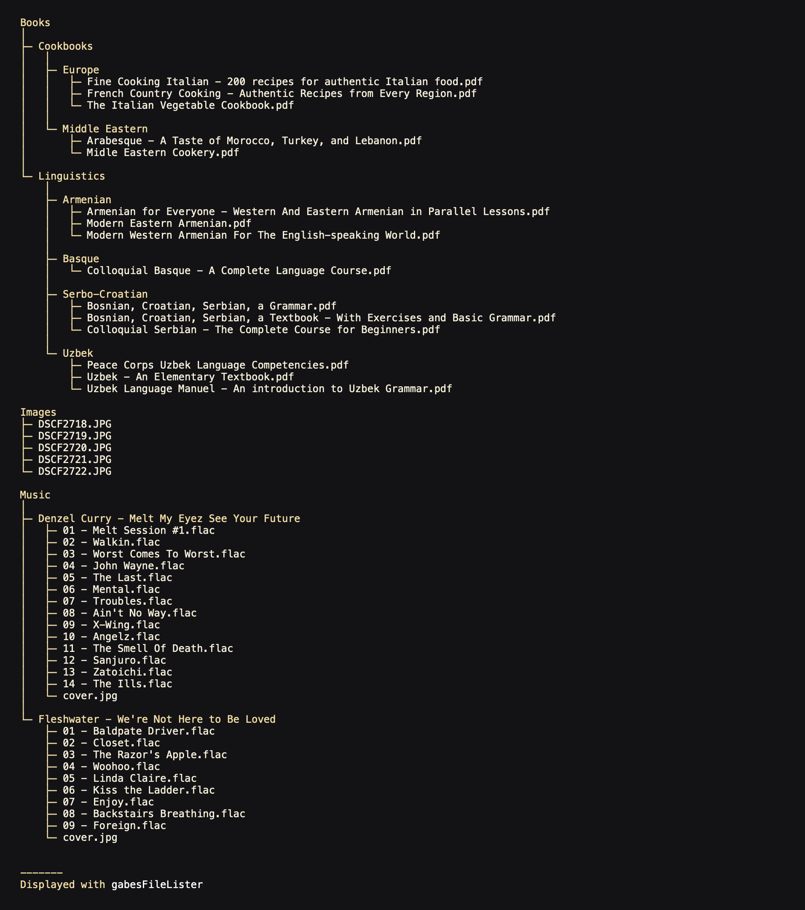

# Gabe's file lister

## What is it?
A simple way to make a downloadable file tree. Just drag the one single PHP file to the directory of your choice and voila!

## Troubleshooting
### Some of my files arent showing up!
Gabe's file lister blocks the following files from appearing in the tree: `gabesFileLister.php` `gabesFileListerMin.php` `.DS_Store`

### Can I change X?
Yes.